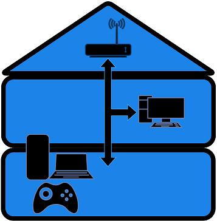

# Stream Play Server (SPS)



Stream Play Server (SPS) is a WebRTC-powered media server for real-time video streaming and remote control of window applications enabling remote gaming experience in a simple web browser environment.

## Demo

Small video showing the usage of SPS using a phone with one controller connected to play a game ([Biped](https://store.steampowered.com/app/1071870/Biped/)) remotely


## Features

- Low latency video streaming of a window application with WebRTC
- Input catching from a browser instance to the server for remote interaction (using Gamepad API + ViGEm for controllers or Windows API SendInput for mouse and keyboard)

## Description


- **Media-Server (Pion WebRTC)**

Handles real-time communication and media streaming to/between peers in a WebRTC-based application (Media Processing and Input Management)

- **Signaling Server**

Intermediary for WebRTC clients to exchange session information and coordinate the establishment of direct peer-to-peer connections

- **Client (Webserver)**

User-facing part of the WebRTC application that runs in the web browser (User Interface)

| Main page         | Admin page         |
| --------------- | --------------- |
|  |  |
| http://ip\_address | http://ip\_address/admin/ |
| There are 3 tabs available for the media stream, controller setup and connection setup | The 5 log files are checked every 10 seconds to display the subprocesses states |

## Custom Installation

Prerequisites : 
- Golang (https://go.dev/doc/install)
- FFmpeg (https://ffmpeg.org/download.html)

Installation steps :
1. Clone the repository.
```
git clone https://github.com/delcourtfl/stream-play-server.git
```
2. Navigate to the project directory.
```cmd
cd stream-play-server
```
3. Install the dependencies before running (optionnal).
```cmd
go get ./...
```
4. Launch the SPS application.
```cmd
go run .
```

## Usage

Set the ip address and port used in the config.json file before running :
```json
{
    "ip_address": "192.168.68.108",
    "port": "3000",
    "window_name": "" // 
}
```

(optional) Modify the ffmpeg commands to suit your needs (capture.go) :
```golang
ffmpegCmdVideo, err = launchCommand(
    "ffmpeg",
    []string{
        "-stats_period", "10",
        "-f", "gdigrab",
        "-thread_queue_size", "1024",
        "-framerate", "30",
        "-i", "title="+windowTitle,
        "-vf", "scale=-1:720",
        "-c:v", "libx264",
        "-preset", "ultrafast",
        "-tune", "zerolatency",
        "-crf", "25",
        "-pix_fmt", "yuv420p",
        "-an",
        "-f", "rtp", "rtp://127.0.0.1:5004?pkt_size=1200",
    },
    "../logs/video.log",
)
...
// Adding Audio streaming introduce latency and needs to be fixed
ffmpegCmdAudio, err = launchCommand(
    "ffmpeg",
    []string{
        "-stats_period", "10",
        "-f", "dshow",
        "-i", "audio=Mixage stéréo (Realtek(R) Audio)",
        "-c:a", "libopus",
        "-application", "lowdelay",
        "-vbr", "off",
        "-compression_level", "0",
        "-frame_duration", "20",
        "-vn",
        "-f", "rtp", "rtp://127.0.0.1:5005",
    },
    "../logs/audio.log",
)
```

Start the application :
```cmd
go run . -ui
```

Once the application is running some commands are available :

- *exit* : close everything
- *stop* : stop the 3 subprocesses (signaling, client, server)
- *sign* : restart signaling server
- *client* : restart client
- *server* : restart media server
- *change* : change the window to stream and restart media server


For the user interface multiple steps are also needed :
- Load the website on http://{your-SPS-instance-ip}
- Go to the *Connection Tab*
    - Video without audio is enabled by default but can be changed
    - Establish the WebRTC connection using the connect button
- Go to the *Controllers Tab*
    - Add as many controllers as you need with the AddController button
    - Configure the mapping manually if it is not a Xbox or PS3 controller
    - Press the init button to start sending inputs to the server
- Go back to the *Game Tab*
    - Game should be playing in the video player after a few seconds
    - Gamepad inputs should be reflected in (almost) realtime on the display
    - Enjoy

## Technologies Used

- HTML, CSS, and JavaScript (for the browser client).
- Golang for everything else.
- [WebRTC](https://webrtc.org/) for low latency media transmission.
- [FFmpeg](https://www.ffmpeg.org/) for media capture and RTP streaming.
- [ViGEm](https://github.com/ViGEm/ViGEmBus) for game controller emulation.
- [GamepadAPI](https://developer.mozilla.org/en-US/docs/Web/API/Gamepad_API) for input reading.

## Areas of Improvement

This project is a work in progress and as such there are areas that are still being refined and improved. This repository is open to any contributions, suggestions and recommendations for improvements and fixes.

Current issues :
- Audio streaming introduces high latency (2-3sec)
- Controllers are hard to map manually in the client browser
- Fullscreen on mobile seem to disable Gamepad API inputs sometimes...
- Gamepad API will need secure context in the future
- Mouse and keyboards inputs are commented out for now (it works but the Windows API SendInput is not made for such application and can't run in background so it needs to put the gaming application in front each time)
- FFmpeg can be quite fickle and might need configuration changes in some cases (e.g. issue with window size not divisible by 2 or window title with special characters)

## License

[MIT License](LICENSE)

## Acknowledgement

- The Pion Webrtc implementation and examples (https://github.com/pion/webrtc).
- The excellent cloud-morph application (https://github.com/giongto35/cloud-morph), which was a great starting point for this (smaller) project.
- The stadiacontroller Xbox emulator for ViGEm usage in golang (https://github.com/71/stadiacontroller).
