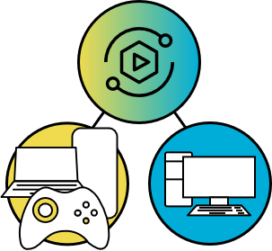

# Stream Play Server (SPS)
# Version 0.0.2



Stream Play Server (SPS) is a WebRTC-powered media server for real-time video streaming and remote control of Windows applications enabling Remote Gaming in a simple web browser environment.

## Demo

Small video showing the usage of SPS using a phone with one controller connected to play a game ([Biped](https://store.steampowered.com/app/1071870/Biped/)) remotely


## Features

- Low latency video streaming of a window application with WebRTC
- Input catching from a browser instance to the server for remote interaction (using Gamepad API + ViGEm for controllers or Windows API SendInput for mouse and keyboard)

## Description

# Version 0.0.2
# Modifications :

- Upgraded the client UI (simplified overall process)
- Removed pion WebRTC and FFMPEG dependencies by using the getDisplayMedia() method of the MediaDevices interface implemented in (most) browsers.
    This was done to improve the performance of the video/audio transmission as I was not able to make it work properly for my use-case using the previous implementation. I would like to avoid depending on the browser methods to focus on a Golang media-server for recording and transmission.And, as such, I will try to follow the development of the Pion MediaDevice implementation.
- For now, hosting is only available on localhost:web\_port due to the required secure contexts for getDisplayMedia().
- Added Gamepad index modification to be able to separate the multiple clients.


# Version 0.0.1


- **Media-Server**

Handles real-time communication and peer inputs to the application (Media Processing and Input Management)

- **Signaling Server**

Intermediary for WebRTC clients to exchange session information and coordinate the establishment of direct peer-to-peer connections

- **Client (Webserver)**

User-facing part of the WebRTC application that runs in the web browser (User Interface)

| Main         |
| --------------- |
|  |
| http://ip\_address:web\_port |
| There are 3 tabs available for the media stream, controller setup and connection setup |

## Custom Installation

Prerequisites : 
- Golang (https://go.dev/doc/install)

Installation steps :
1. Clone the repository.
```
git clone https://github.com/delcourtfl/stream-play-server.git
```
2. Navigate to the project directory.
```cmd
cd stream-play-server
```
3. Install the dependencies before running (optionnal).
```cmd
go get ./...
```
4. Modify the config.json file to change the ip address and ports used.
```json
{
    "ip_address": "192.168.68.101",
    "web_port": "3000",
    "sign_port": "3001",
    "input_port": "3002"
}
```
5. (optional) Modify the media capture settings to suit your needs (webrtc.js).
```js
const displayMediaOptions = { 
    video: getVideo ? {
        width: { ideal: 1280 },
        height: { ideal: 720 },
        frameRate: { max: 30 },
        latency: 0
    } : false,
    audio: getAudio ? {
        noiseSuppression: false,
        autoGainControl: false,
        echoCancellation: false,
        sampleRate: 48000,
        latency: 0
    } : false
};
```
6. Launch the SPS application.
```cmd
go run .
```

## Usage

Once the application is running some commands are available :

- *exit* : close everything
- *stop* : stop the 3 subprocesses (signaling, client, server)
- *sign* : restart signaling server
- *client* : restart client webserver
- *server* : restart media server
- *change* : change the window to stream and restart media server


For the user interface multiple steps are also needed :
- Load the website on http://{your-SPS-instance-ip}
- Go to the *Connection Tab*
    - Video without audio is enabled by default but can be changed
    - Establish the WebRTC connection using the connect button
- Go to the *Controllers Tab*
    - Add as many controllers as you need with the AddController button
    - Configure the mapping manually if it is not a Xbox or PS3 controller
    - Press the init button to start sending inputs to the server
- Go back to the *Game Tab*
    - Game should be playing in the video player after a few seconds
    - Gamepad inputs should be reflected in (almost) realtime on the display
    - Enjoy


## Technologies Used

- HTML, CSS, and JavaScript (for the browser client/host instance).
- Golang for the input management, the webserver and signaling server.
- [WebRTC](https://webrtc.org/) for low latency media transmission.
- [ViGEm](https://github.com/ViGEm/ViGEmBus) for game controller emulation.
- [GamepadAPI](https://developer.mozilla.org/en-US/docs/Web/API/Gamepad_API) for input reading.

## Areas of Improvement

This project is a work in progress and as such there are areas that are still being refined and improved. This repository is open to any contributions, suggestions and recommendations for improvements and fixes.

Current issues :
- Video + inputs introduce latency that is still too high for many games (WiFi tests on my network showed a delay of about 0.5 to 1 second between action and visual feedback on 720p 30FPS)
- Audio recording for specific application is not supported in getDisplayMedia() (or not at all for some browsers)
- Controllers are hard to map manually in the client browser
- Gamepad API will need secure context in the future

## License

[MIT License](LICENSE)

## Acknowledgement

- The Pion Webrtc implementation and examples (https://github.com/pion/webrtc).
- The excellent cloud-morph application (https://github.com/giongto35/cloud-morph), which was a great starting point for this (smaller) project.
- The stadiacontroller Xbox emulator for ViGEm usage in golang (https://github.com/71/stadiacontroller).
- The tutorial for the visual gamepad interface (https://github.com/CodingWith-Adam/gamepad-tester-simple-just-controller).
- The WebRTC Web demos and samples (https://github.com/webrtc/samples).
- The Pion MediaDevices implementation (for future follow-up) (https://github.com/pion/mediadevices).
